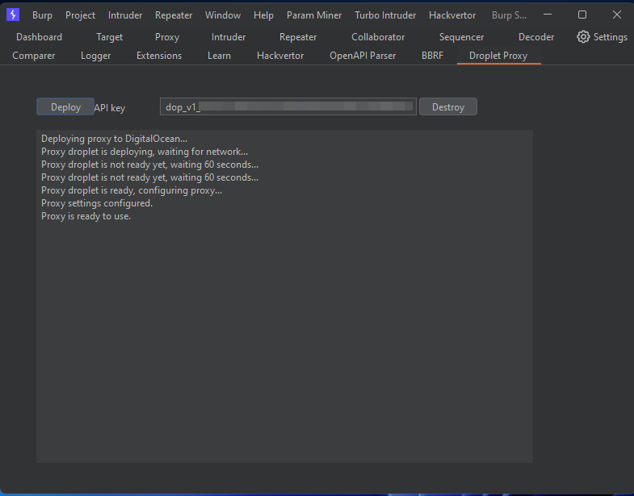
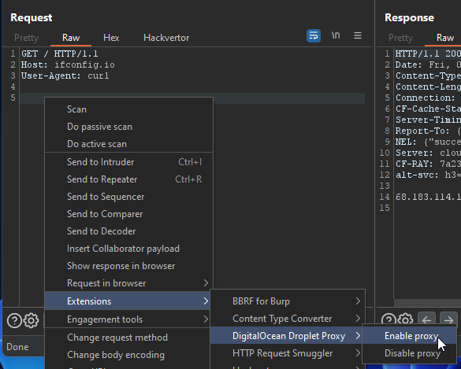

## DigitalOcean Droplet Proxy for Burp Suite

Use this Burp plugin to automatically spin up a DigitalOcean droplet whenever Burp starts, and shut it down whenever Burp closes. The droplet functions as a SOCKS5 proxy, and the Burp settings are automatically updated to route traffic through the droplet.

### How to use

1. Download the JAR from `build/libs/digitalocean-droplet-proxy-all.jar` or build from source yourself;
2. Load the extension in Burp via the Extensions tab;
3. Create a DigitalOcean API token and enter your token on the extension tab "Droplet Proxy";
4. Click "Deploy" to start deploying the socks proxy droplet, and the extension will take care of the rest;
5. Allow up to a few minutes for the Docker image to complete installation before the proxy starts responding

### Features

* Remember your DigitalOcean API token;
* Automatically spins up a droplet when Burp opens or the extension is loaded;
* Automatically shut down the droplet when Burp closes or the extension is unloaded;
* A context menu so you can right-click > enable or disable proxy to temporarily turn on/off the proxy settings

### Potential improvements

* add an option to allow persisting the droplet when shutting down Burp to avoid the waiting time on startup - although this could result in unexpected DigitalOcean cost;
* the GUI needs some love

Feel free to use the link below to set up your DigitalOcean account. If you use this referral link, you get $200 in credit, and I get $25 for every $25 you spend.

